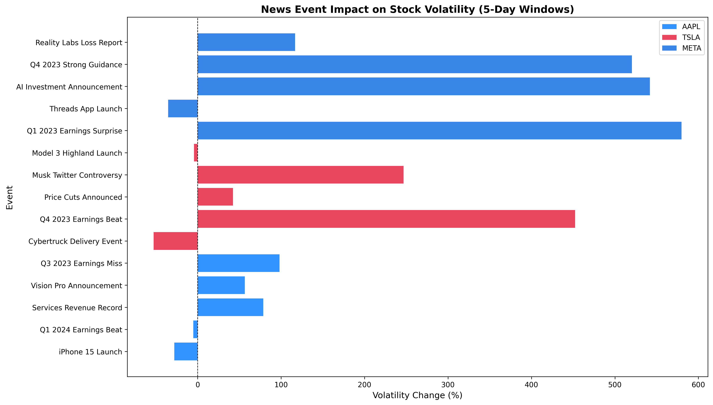
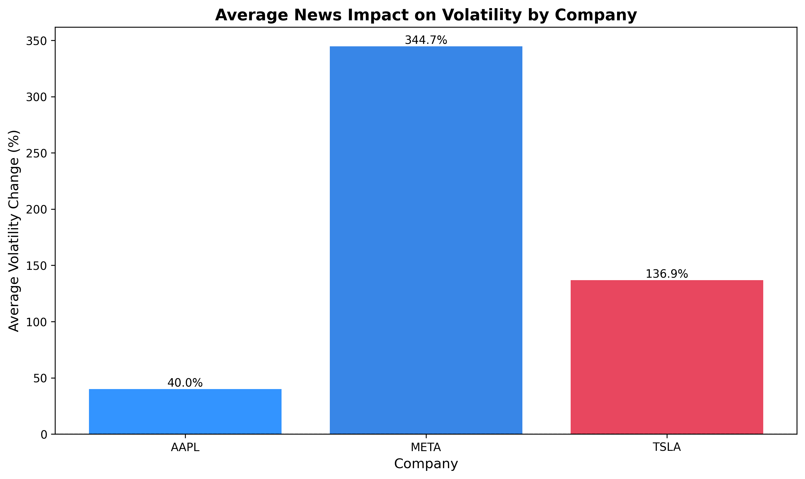

# News Event Impact on Stock Volatility

An event study measuring how major news events affect short-term stock price volatility across three tech companies (Apple, Tesla, Meta), using Python and daily price data from Yahoo Finance.

## Dataset

- **Prices:** Yahoo Finance daily data (yfinance), 2023 to 2024, adjusted close
- **Events:** 15 manually tagged news events across the three companies, covering earnings, product launches, and regulatory and corporate news
- **Companies:** Apple (AAPL), Tesla (TSLA), Meta (META)

## Objective

Test a single question. Do major news events systematically change short-term volatility, and in which direction?

## Method

- Pulled daily adjusted prices for each company
- For each event, calculated daily-return volatility (standard deviation) in the 5 trading days before and the 5 trading days after
- Measured the percentage change from the before window to the after window
- Aggregated across events, by direction and by company

## Key Findings

**Direction is the robust result. News events increase short-term volatility more often than not.**

- 10 of 15 events (67%) showed increased volatility in the five days after the event
- 5 of 15 (33%) showed decreased volatility
- The clearest increases followed earnings surprises and unexpected strategic announcements. The decreases tended to follow events the market already saw coming, like product launches

**Magnitude points in a direction but isn't precise.** Post-event volatility changes ranged from -53% to +580%. The very largest figures are not reliable (see Limitations), so this project treats magnitude as a rough signal rather than a measured quantity.





## Insights

**1. Anticipation matters more than the news itself**

The events that lowered volatility were the ones the market saw coming. The iPhone 15 launch, the Cybertruck delivery event, the Threads launch. Volatility spiked hardest on genuine surprises like earnings misses and unexpected strategic shifts. The tradeable signal isn't that news happened. It's whether the news was something the market hadn't already expected.

**2. The effect is uneven across companies**

Meta's events moved volatility far more than Apple's. Applying one framework across three stocks surfaces something a single-stock study would miss: the same category of event, an earnings report, doesn't carry the same volatility risk for each company. Anyone trading around these announcements would want to know that in advance.

## Limitations

This is an exploratory event study on a small, hand-picked sample, and the numbers should be read that way.

- **Small-denominator distortion.** When pre-event volatility is very low, the percentage change explodes. Four Meta events show increases above 500%, which reflects a tiny baseline rather than a genuine 5x move. Hence the project leads with direction (67% of events) rather than the +174% raw average, which those four readings dominate.
- **Small sample.** 15 events across 3 companies. Enough to observe a pattern, not enough to prove one.
- **Manual event tagging.** No automated news detection or sentiment scoring. Events were selected and dated by hand.
- **No market adjustment.** Volatility changes aren't adjusted for market-wide moves, so some of the effect may be market rather than company-specific.
- **Simple volatility measure.** Standard deviation of returns, rather than GARCH or implied volatility.

## Next Steps

1. Handle the extreme low-baseline events so a few distorted percentages don't skew the average
2. Compare each company against the wider market to separate company-specific moves from market-wide ones
3. Expand beyond 15 events and 3 companies so the sample can support real statistical testing
4. Label events as good or bad news to test whether negative surprises move volatility more
5. Separate expected events from genuine surprises directly, since that is the pattern the findings point to

## Tools & Methods

- Python (pandas, numpy, matplotlib)
- yfinance for Yahoo Finance data
- Event study methodology
- Time-series volatility calculation

## Files in This Repo

- `news_volatility_analysis.py` — the analysis script
- `requirements.txt` — Python dependencies
- `volatility_results.csv` — full per-event results
- `news_volatility_impact.png` — volatility change by event
- `volatility_by_company.png` — average change by company
- `README.md` — project documentation

## How to Run

```bash
pip install -r requirements.txt
python news_volatility_analysis.py
```

The script fetches live data, so exact figures move slightly with each run. Direction and rough magnitude stay stable. The precise percentages do not.

---

Built: Built February 2026 · Rebuilt: July 2026

Skills: Python · pandas · Event Study · Time-series Analysis · Data Visualisation
